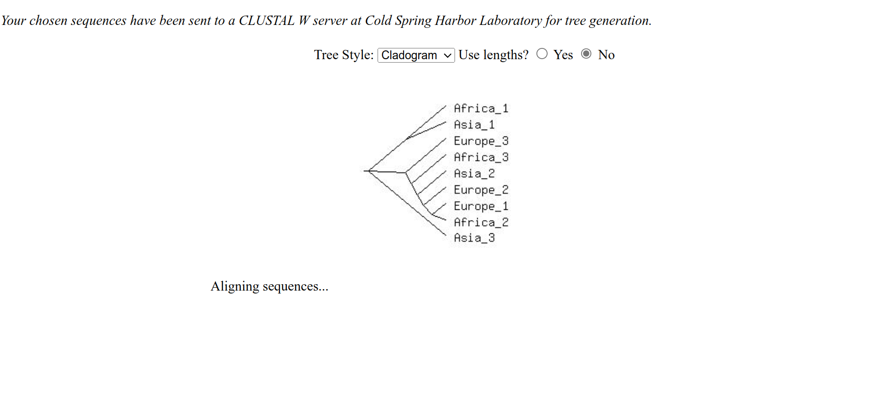
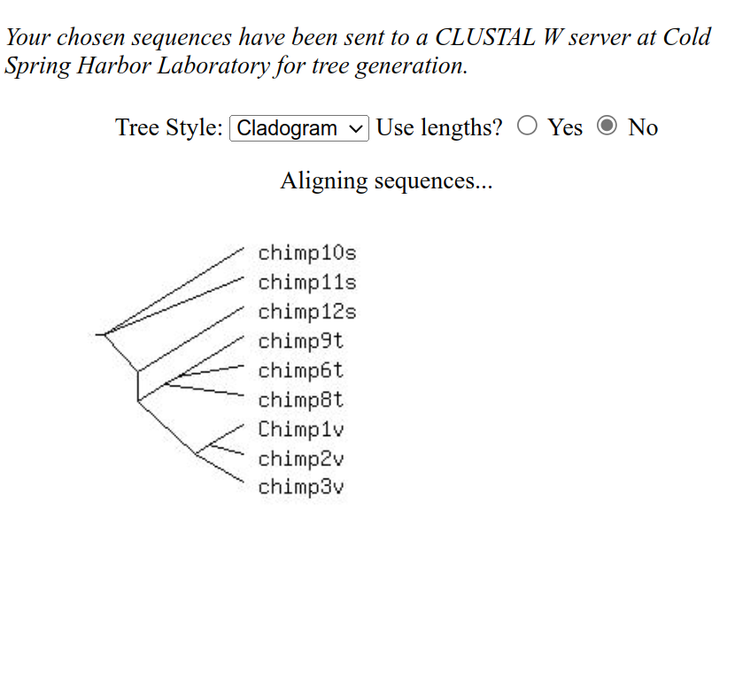

# Human Race Lab Report

## Introduction

### Hypothesis

In humans, there are distinct races or subspecies, that have biological genetic markers.

### Predicted Results

When comparing 3 groups of humans, the genetic differences between individuals in different groups will be greater than the genetic differences between individuals in the same group.

## Results

(see end of document for data)

## Discussion

### Conclusion

According to our lab manual, the hypothesis was that there are distinct, biological genetic markers that separate humans into different races or subspecies (Marion & Preszler 2019). The predicted results were that the genetic differences between individuals in different groups would be greater than the genetic differences between individuals in the same group.

However, the observed results from Table 19-2 and the cladogram of human sequences (Figure 19-2) showed that the genetic differences between individuals in different groups are not significantly greater than the genetic differences between individuals in the same group.

Therefore, the hypothesis that there are distinct genetic markers separating humans into different races is not supported by the data. The evidence from Table 19-2 and Figure 19-2 demonstrates that there is not a genetic basis for the separation of humans into different subspecies as one would expect such as in the case of different subspecies of chimpanzees in table 19-1 and the cladogram of chimpanzee sequences in Figure 19-1. There are even cases where the difference between individuals in the same group is greater than the difference between individuals in different groups.

### Implications

If the division of humans into different races cannot be based on a genetic distinction between different populations, then the basis of "race" must be social, cultural, and historical factors.

With respect to humans, the concept of "race" does not have a useful function in society today and should be eliminated as a method of categorizing people. However, it is still important to recognize that there has been a long history of racial discrimination and inequality based on these social constructs and that these issues need to be addressed through social justice and equity measures.

## References

- Marion, A. L., & Preszler, R. W. (2019). Biology 101 Human Biology & Society Laboratory Manual (9th ed., Vols. 1–9). Harden-McNeil

## Data

Figure 19-2: Cladogram of human sequences

Figure 19-1: Cladogram of chimpanzee sequences
